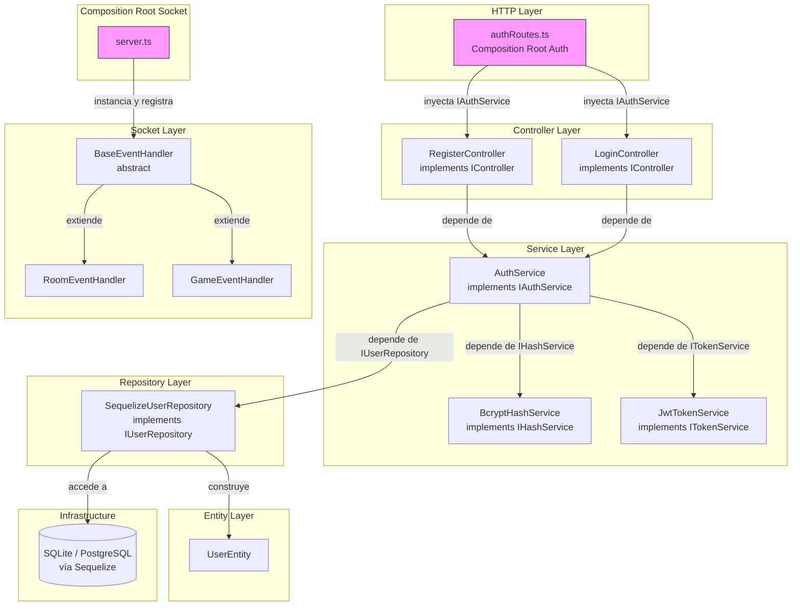
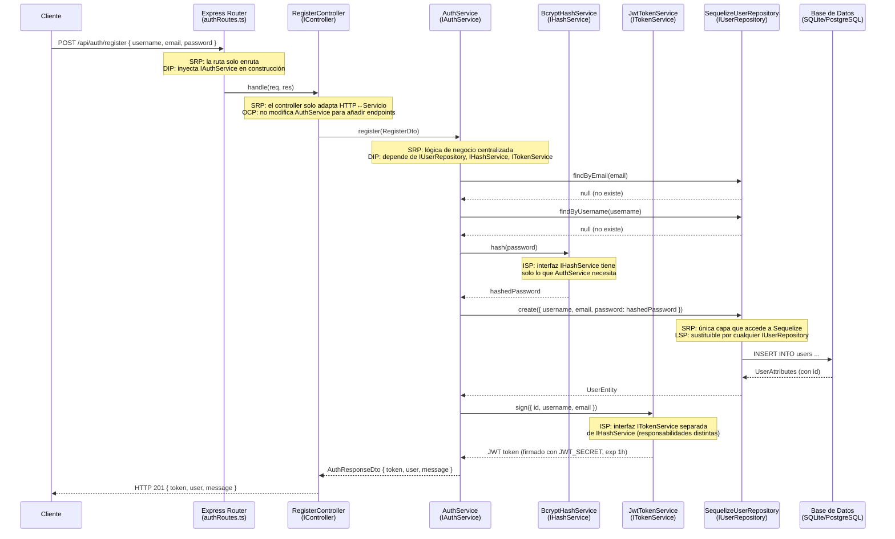

# Documento de Diseño — Backend SOLID Refactor

## Resumen de Investigación

### Tecnologías clave y hallazgos

**TypeScript + Express**: La migración de CommonJS a TypeScript con `"strict": true` implica reemplazar `require()` por imports con tipado estático. Express ofrece `@types/express` con tipado completo para `Request`, `Response` y `NextFunction`. El patrón de controladores con métodos `handle` es compatible con el middleware de Express mediante arrow functions que cierran sobre `this`.

**Sequelize + TypeScript**: Sequelize v6 tiene soporte oficial para TypeScript mediante `sequelize-typescript` o usando la API nativa con `ModelDefined<Attributes, CreationAttributes>`. Para mantener compatibilidad con el código actual (SQLite/PostgreSQL según entorno) se recomienda mantener el modelo como función factory con los tipos de Sequelize.

**Socket.IO + TypeScript**: Socket.IO v4 incluye `@types/socket.io` en el propio paquete. El tipo `Socket` proviene de `socket.io`. El patrón de herencia con `BaseEventHandler` abstracto es idiomatic en TypeScript: el método abstracto `registerEvents(socket: Socket): void` obliga a las subclases a implementarlo.

**fast-check**: Biblioteca de property-based testing para JavaScript/TypeScript. Permite generar inputs aleatorios y verificar propiedades universales. Se integra con Jest mediante `fc.assert(fc.property(...))`. Usaremos `fc.string()`, `fc.record()`, `fc.integer()` para los generadores.

**Fuentes consultadas**:
- [TypeScript Handbook - Classes](https://www.typescriptlang.org/docs/handbook/2/classes.html) — modificadores `private`, `readonly`, `abstract`
- [fast-check documentation](https://fast-check.io/) — API de generadores y aserciones
- [Socket.IO TypeScript guide](https://socket.io/docs/v4/typescript/) — tipado de eventos y servidores

---

## Visión General

La refactorización migra el backend de **Elemental Battlecards** de un único archivo monolítico CommonJS a una arquitectura en capas TypeScript que aplica los cinco principios SOLID y los cuatro pilares de la POO exigidos por el taller ADSO.

Los módulos afectados son dos:

- **Auth Module**: gestiona el registro e inicio de sesión de usuarios mediante una pila `Controller → Service → Repository` con interfaces que desacoplan cada capa de su implementación concreta.
- **Socket Module**: gestiona la creación/unión de salas y los eventos de partida en tiempo real mediante una jerarquía de clases `BaseEventHandler → RoomEventHandler / GameEventHandler`.

El frontend no se modifica: la API REST (`POST /api/auth/register`, `POST /api/auth/login`) y los eventos Socket.IO (`create_room`, `join_room`, `game_event`, `end_turn`) mantienen sus contratos actuales.

---

## Arquitectura

### Diagrama de arquitectura en capas



> Las flechas de dependencia apuntan siempre hacia **abstracciones** (interfaces o clases abstractas). Ninguna capa de nivel superior conoce la clase concreta de su dependencia. Solo el Composition Root (`authRoutes.ts` y `server.ts`) instancia concretamente.

### Estructura de carpetas objetivo

```
Backend/
├── src/
│   ├── entities/
│   │   └── UserEntity.ts
│   ├── interfaces/
│   │   ├── IUserRepository.ts
│   │   ├── IAuthService.ts
│   │   ├── IHashService.ts
│   │   ├── ITokenService.ts
│   │   └── IController.ts
│   ├── dtos/
│   │   ├── RegisterDto.ts
│   │   ├── LoginDto.ts
│   │   └── AuthResponseDto.ts
│   ├── repositories/
│   │   └── SequelizeUserRepository.ts
│   ├── services/
│   │   ├── AuthService.ts
│   │   ├── BcryptHashService.ts
│   │   └── JwtTokenService.ts
│   ├── controllers/
│   │   ├── RegisterController.ts
│   │   └── LoginController.ts
│   ├── routes/
│   │   └── authRoutes.ts          ← Composition Root Auth
│   ├── socket/
│   │   ├── BaseEventHandler.ts
│   │   ├── RoomEventHandler.ts
│   │   └── GameEventHandler.ts
│   ├── models/
│   │   ├── user.ts
│   │   └── index.ts
│   ├── config/
│   │   └── db.ts
│   └── server.ts                  ← Composition Root Socket + entrada
├── tsconfig.json
└── package.json
```

---

## Componentes e Interfaces

### DTOs (`src/dtos/`)

#### `RegisterDto.ts`

```typescript
// src/dtos/RegisterDto.ts
export interface RegisterDto {
  username: string;
  email: string;
  password: string;
}
```

#### `LoginDto.ts`

```typescript
// src/dtos/LoginDto.ts
export interface LoginDto {
  username?: string;
  email?: string;
  password: string;
}
```

#### `AuthResponseDto.ts`

```typescript
// src/dtos/AuthResponseDto.ts
export interface UserPublicDto {
  id: number;
  username: string;
  email: string;
}

export interface AuthResponseDto {
  token: string;
  user: UserPublicDto;
  message?: string;
}
```

---

### Interfaces (`src/interfaces/`)

#### `IUserRepository.ts`

```typescript
// src/interfaces/IUserRepository.ts
import { RegisterDto } from '../dtos/RegisterDto';
import { UserEntity } from '../entities/UserEntity';

export interface IUserRepository {
  findByEmail(email: string): Promise<UserEntity | null>;
  findByUsername(username: string): Promise<UserEntity | null>;
  create(data: RegisterDto): Promise<UserEntity>;
}
```

#### `IAuthService.ts`

```typescript
// src/interfaces/IAuthService.ts
import { RegisterDto } from '../dtos/RegisterDto';
import { LoginDto } from '../dtos/LoginDto';
import { AuthResponseDto } from '../dtos/AuthResponseDto';

export interface IAuthService {
  register(dto: RegisterDto): Promise<AuthResponseDto>;
  login(dto: LoginDto): Promise<AuthResponseDto>;
}
```

#### `IHashService.ts`

```typescript
// src/interfaces/IHashService.ts
export interface IHashService {
  hash(plain: string): Promise<string>;
  compare(plain: string, hashed: string): Promise<boolean>;
}
```

#### `ITokenService.ts`

```typescript
// src/interfaces/ITokenService.ts
export interface TokenPayload {
  id: number;
  username: string;
  email: string;
}

export interface ITokenService {
  sign(payload: TokenPayload): string;
  verify(token: string): TokenPayload;
}
```

#### `IController.ts`

```typescript
// src/interfaces/IController.ts
import { Request, Response } from 'express';

export interface IController {
  handle(req: Request, res: Response): Promise<void>;
}
```

---

### Entidades (`src/entities/`)

#### `UserEntity.ts`

La entidad encapsula los datos de dominio del usuario. Sus atributos son `private readonly` para prevenir mutación externa (Requisito 3.1).

```typescript
// src/entities/UserEntity.ts
export class UserEntity {
  private readonly _id: number;
  private readonly _username: string;
  private readonly _email: string;
  private readonly _passwordHash: string;

  constructor(id: number, username: string, email: string, passwordHash: string) {
    this._id = id;
    this._username = username;
    this._email = email;
    this._passwordHash = passwordHash;
  }

  get id(): number { return this._id; }
  get username(): string { return this._username; }
  get email(): string { return this._email; }
  get passwordHash(): string { return this._passwordHash; }
}
```

---

### Repositorios (`src/repositories/`)

#### `SequelizeUserRepository.ts`

Única clase que importa el modelo Sequelize (Requisito 1.5). La dependencia del modelo se inyecta por constructor para facilitar el testing.

```typescript
// src/repositories/SequelizeUserRepository.ts
import { ModelDefined } from 'sequelize';
import { IUserRepository } from '../interfaces/IUserRepository';
import { RegisterDto } from '../dtos/RegisterDto';
import { UserEntity } from '../entities/UserEntity';

// Atributos del modelo Sequelize para User
export interface UserAttributes {
  id: number;
  username: string;
  email: string;
  password: string;
  createdAt?: Date;
  updatedAt?: Date;
}

export interface UserCreationAttributes {
  username: string;
  email: string;
  password: string;
}

export class SequelizeUserRepository implements IUserRepository {
  private readonly userModel: ModelDefined<UserAttributes, UserCreationAttributes>;

  constructor(userModel: ModelDefined<UserAttributes, UserCreationAttributes>) {
    this.userModel = userModel;
  }

  async findByEmail(email: string): Promise<UserEntity | null> {
    const record = await this.userModel.findOne({ where: { email } });
    if (!record) return null;
    const data = record.get() as UserAttributes;
    return new UserEntity(data.id, data.username, data.email, data.password);
  }

  async findByUsername(username: string): Promise<UserEntity | null> {
    const record = await this.userModel.findOne({ where: { username } });
    if (!record) return null;
    const data = record.get() as UserAttributes;
    return new UserEntity(data.id, data.username, data.email, data.password);
  }

  async create(dto: RegisterDto & { password: string }): Promise<UserEntity> {
    const record = await this.userModel.create({
      username: dto.username,
      email: dto.email,
      password: dto.password,
    });
    const data = record.get() as UserAttributes;
    return new UserEntity(data.id, data.username, data.email, data.password);
  }
}
```

---

### Servicios (`src/services/`)

#### `BcryptHashService.ts`

```typescript
// src/services/BcryptHashService.ts
import bcrypt from 'bcryptjs';
import { IHashService } from '../interfaces/IHashService';

export class BcryptHashService implements IHashService {
  private readonly saltRounds: number;

  constructor(saltRounds = 10) {
    this.saltRounds = saltRounds;
  }

  async hash(plain: string): Promise<string> {
    return bcrypt.hash(plain, this.saltRounds);
  }

  async compare(plain: string, hashed: string): Promise<boolean> {
    return bcrypt.compare(plain, hashed);
  }
}
```

#### `JwtTokenService.ts`

Valida en construcción que `JWT_SECRET` esté definido, cumpliendo el Requisito 7.7 (el servidor rechaza el arranque si falta el secreto).

```typescript
// src/services/JwtTokenService.ts
import jwt from 'jsonwebtoken';
import { ITokenService, TokenPayload } from '../interfaces/ITokenService';

export class JwtTokenService implements ITokenService {
  private readonly secret: string;
  private readonly expiresIn: string;

  constructor(secret: string, expiresIn = '1h') {
    if (!secret) {
      throw new Error('JWT_SECRET es obligatorio. El servidor no puede arrancar sin él.');
    }
    this.secret = secret;
    this.expiresIn = expiresIn;
  }

  sign(payload: TokenPayload): string {
    return jwt.sign({ user: payload }, this.secret, { expiresIn: this.expiresIn });
  }

  verify(token: string): TokenPayload {
    const decoded = jwt.verify(token, this.secret) as { user: TokenPayload };
    return decoded.user;
  }
}
```

#### `AuthService.ts`

Contiene toda la lógica de negocio de autenticación. Recibe sus tres dependencias por constructor (DIP). No importa ninguna implementación concreta (Requisito 2.6).

```typescript
// src/services/AuthService.ts
import { IAuthService } from '../interfaces/IAuthService';
import { IUserRepository } from '../interfaces/IUserRepository';
import { IHashService } from '../interfaces/IHashService';
import { ITokenService } from '../interfaces/ITokenService';
import { RegisterDto } from '../dtos/RegisterDto';
import { LoginDto } from '../dtos/LoginDto';
import { AuthResponseDto } from '../dtos/AuthResponseDto';

export class AuthError extends Error {
  constructor(
    message: string,
    public readonly statusCode: number,
  ) {
    super(message);
    this.name = 'AuthError';
  }
}

export class AuthService implements IAuthService {
  private readonly repository: IUserRepository;
  private readonly hashService: IHashService;
  private readonly tokenService: ITokenService;

  constructor(
    repository: IUserRepository,
    hashService: IHashService,
    tokenService: ITokenService,
  ) {
    this.repository = repository;
    this.hashService = hashService;
    this.tokenService = tokenService;
  }

  async register(dto: RegisterDto): Promise<AuthResponseDto> {
    // Validación de campos
    if (!dto.username || !dto.email || !dto.password) {
      const missing = [
        !dto.username && 'username',
        !dto.email && 'email',
        !dto.password && 'password',
      ].filter(Boolean).join(', ');
      throw new AuthError(`Faltan los campos: ${missing}.`, 400);
    }

    // Verificar duplicados
    const byEmail = await this.repository.findByEmail(dto.email);
    if (byEmail) throw new AuthError('El correo electrónico ya está en uso.', 409);

    const byUsername = await this.repository.findByUsername(dto.username);
    if (byUsername) throw new AuthError('El nombre de usuario ya está en uso.', 409);

    // Hash de la contraseña
    const hashedPassword = await this.hashService.hash(dto.password);

    // Persistir
    const user = await this.repository.create({ ...dto, password: hashedPassword });

    // Firmar token
    const token = this.tokenService.sign({ id: user.id, username: user.username, email: user.email });

    return {
      token,
      user: { id: user.id, username: user.username, email: user.email },
      message: 'Usuario registrado exitosamente.',
    };
  }

  async login(dto: LoginDto): Promise<AuthResponseDto> {
    // Validar campos obligatorios
    if (!dto.password) {
      throw new AuthError('La contraseña es obligatoria.', 400);
    }
    if (!dto.username && !dto.email) {
      throw new AuthError('Proporciona username o email.', 400);
    }

    // Buscar usuario
    let user = null;
    if (dto.username) {
      user = await this.repository.findByUsername(dto.username);
    } else if (dto.email) {
      user = await this.repository.findByEmail(dto.email);
    }

    // Verificar credenciales — mismo mensaje en ambos casos (no revela si el usuario existe)
    const isMatch = user ? await this.hashService.compare(dto.password, user.passwordHash) : false;
    if (!user || !isMatch) {
      throw new AuthError('Credenciales inválidas.', 401);
    }

    const token = this.tokenService.sign({ id: user.id, username: user.username, email: user.email });

    return {
      token,
      user: { id: user.id, username: user.username, email: user.email },
    };
  }
}
```

---

### Controladores (`src/controllers/`)

Los controladores implementan `IController` y actúan como adaptadores entre Express y el servicio. No contienen lógica de negocio (Requisito 1.3).

#### `RegisterController.ts`

```typescript
// src/controllers/RegisterController.ts
import { Request, Response } from 'express';
import { IController } from '../interfaces/IController';
import { IAuthService } from '../interfaces/IAuthService';
import { AuthError } from '../services/AuthService';

export class RegisterController implements IController {
  private readonly authService: IAuthService;

  constructor(authService: IAuthService) {
    this.authService = authService;
  }

  async handle(req: Request, res: Response): Promise<void> {
    try {
      const result = await this.authService.register(req.body);
      res.status(201).json(result);
    } catch (error) {
      if (error instanceof AuthError) {
        res.status(error.statusCode).json({ message: error.message });
        return;
      }
      console.error('Error en registro:', error);
      res.status(500).json({ message: 'Error en el servidor.' });
    }
  }
}
```

#### `LoginController.ts`

```typescript
// src/controllers/LoginController.ts
import { Request, Response } from 'express';
import { IController } from '../interfaces/IController';
import { IAuthService } from '../interfaces/IAuthService';
import { AuthError } from '../services/AuthService';

export class LoginController implements IController {
  private readonly authService: IAuthService;

  constructor(authService: IAuthService) {
    this.authService = authService;
  }

  async handle(req: Request, res: Response): Promise<void> {
    try {
      const result = await this.authService.login(req.body);
      res.status(200).json(result);
    } catch (error) {
      if (error instanceof AuthError) {
        res.status(error.statusCode).json({ message: error.message });
        return;
      }
      console.error('Error en login:', error);
      res.status(500).json({ message: 'Error en el servidor.' });
    }
  }
}
```

---

### Capa Socket (`src/socket/`)

#### `BaseEventHandler.ts`

Clase abstracta que define el contrato y comparte comportamiento de emisión (Requisito 4.1 y 4.2).

```typescript
// src/socket/BaseEventHandler.ts
import { Server, Socket } from 'socket.io';

export interface Player {
  socketId: string;
  role: 'host' | 'guest';
}

export interface GameState {
  currentTurn: 'host' | 'guest';
  turnNumber: number;
}

export interface Room {
  players: Player[];
  gameState: GameState;
  createdAt: number;
}

export type RoomMap = Map<string, Room>;

export abstract class BaseEventHandler {
  protected readonly io: Server;
  protected readonly rooms: RoomMap;

  constructor(io: Server, rooms: RoomMap) {
    this.io = io;
    this.rooms = rooms;
  }

  /** Cada subclase registra sus propios eventos sobre el socket conectado. */
  abstract registerEvents(socket: Socket): void;

  /** Emite un evento a todos los sockets de una sala. */
  protected emitToRoom(code: string, event: string, data: unknown): void {
    this.io.to(code).emit(event, data);
  }

  /** Devuelve la sala si existe, o null en caso contrario. */
  protected getRoomOrFail(code: string): Room | null {
    return this.rooms.get(code) ?? null;
  }
}
```

#### `RoomEventHandler.ts`

```typescript
// src/socket/RoomEventHandler.ts
import { Socket } from 'socket.io';
import { BaseEventHandler } from './BaseEventHandler';

export class RoomEventHandler extends BaseEventHandler {
  private generateCode(): string {
    let code: string;
    do {
      code = Math.floor(100000 + Math.random() * 900000).toString();
    } while (this.rooms.has(code));
    return code;
  }

  registerEvents(socket: Socket): void {
    socket.on('create_room', (cb?: (res: unknown) => void) => {
      const code = this.generateCode();
      this.rooms.set(code, {
        players: [{ socketId: socket.id, role: 'host' }],
        gameState: { currentTurn: 'host', turnNumber: 0 },
        createdAt: Date.now(),
      });
      socket.join(code);
      (socket as Socket & { roomCode?: string; playerRole?: string }).roomCode = code;
      (socket as Socket & { roomCode?: string; playerRole?: string }).playerRole = 'host';

      console.log(`✅ Sala creada ${code} por ${socket.id} (host)`);
      if (typeof cb === 'function') cb({ success: true, code, role: 'host' });
      this.emitToRoom(code, 'room_created', { code });
    });

    socket.on('join_room', (data: { code?: string }, cb?: (res: unknown) => void) => {
      const code = data?.code?.toString().replace(/\s+/g, '') ?? '';
      const room = this.getRoomOrFail(code);

      if (!room) {
        if (typeof cb === 'function') cb({ success: false, message: 'Sala no encontrada.' });
        return;
      }
      if (room.players.length >= 2) {
        if (typeof cb === 'function') cb({ success: false, message: 'Sala llena.' });
        return;
      }

      room.players.push({ socketId: socket.id, role: 'guest' });
      socket.join(code);
      (socket as Socket & { roomCode?: string; playerRole?: string }).roomCode = code;
      (socket as Socket & { roomCode?: string; playerRole?: string }).playerRole = 'guest';

      if (typeof cb === 'function') cb({ success: true, code, role: 'guest' });
      this.emitToRoom(code, 'player_joined', {
        players: room.players.length,
        canStart: room.players.length === 2,
      });

      if (room.players.length === 2) {
        this.emitToRoom(code, 'game_start', {
          currentTurn: 'host',
          hostId: room.players[0].socketId,
          guestId: room.players[1].socketId,
        });
      }
    });

    socket.on('disconnect', () => {
      const extSocket = socket as Socket & { roomCode?: string };
      const code = extSocket.roomCode;
      if (!code) return;
      const room = this.getRoomOrFail(code);
      if (!room) return;

      room.players = room.players.filter((p) => p.socketId !== socket.id);
      if (room.players.length === 0) {
        this.rooms.delete(code);
        console.log(`Sala ${code} eliminada (vacía)`);
      } else {
        this.emitToRoom(code, 'player_left', {});
      }
    });
  }
}
```

#### `GameEventHandler.ts`

```typescript
// src/socket/GameEventHandler.ts
import { Socket } from 'socket.io';
import { BaseEventHandler } from './BaseEventHandler';

export class GameEventHandler extends BaseEventHandler {
  registerEvents(socket: Socket): void {
    const extSocket = socket as Socket & { roomCode?: string; playerRole?: string };

    socket.on('game_event', (payload: unknown) => {
      const code = extSocket.roomCode;
      if (!code || !this.getRoomOrFail(code)) return;
      socket.to(code).emit('game_event', payload);
    });

    socket.on('end_turn', () => {
      const code = extSocket.roomCode;
      const room = code ? this.getRoomOrFail(code) : null;
      if (!room) return;

      const currentRole = extSocket.playerRole as 'host' | 'guest';
      room.gameState.currentTurn = currentRole === 'host' ? 'guest' : 'host';
      room.gameState.turnNumber += 1;

      this.emitToRoom(code!, 'turn_changed', {
        currentTurn: room.gameState.currentTurn,
        turnNumber: room.gameState.turnNumber,
      });
    });
  }
}
```

---

### Composition Root — Auth (`src/routes/authRoutes.ts`)

```typescript
// src/routes/authRoutes.ts  — Composition Root Auth
import { Router, Request, Response } from 'express';
import { SequelizeUserRepository } from '../repositories/SequelizeUserRepository';
import { BcryptHashService } from '../services/BcryptHashService';
import { JwtTokenService } from '../services/JwtTokenService';
import { AuthService } from '../services/AuthService';
import { RegisterController } from '../controllers/RegisterController';
import { LoginController } from '../controllers/LoginController';
import { db } from '../models';

const router = Router();

// --- Construcción del grafo de dependencias (orden obligatorio) ---
const userRepo     = new SequelizeUserRepository(db.User);
const hashService  = new BcryptHashService(10);
const tokenService = new JwtTokenService(process.env.JWT_SECRET!);
const authService  = new AuthService(userRepo, hashService, tokenService);
const registerCtrl = new RegisterController(authService);
const loginCtrl    = new LoginController(authService);

// --- Rutas ---
router.post('/register', (req: Request, res: Response) => registerCtrl.handle(req, res));
router.post('/login',    (req: Request, res: Response) => loginCtrl.handle(req, res));

export default router;
```

### Composition Root — Socket (`src/server.ts`)

```typescript
// src/server.ts  — Composition Root Socket + punto de entrada
import 'dotenv/config';
import express from 'express';
import bodyParser from 'body-parser';
import http from 'http';
import https from 'https';
import fs from 'fs';
import cors from 'cors';
import { Server, Socket } from 'socket.io';

import { connectDB } from './config/db';
import { displayNetworkInfo } from './show-network-info';
import { RoomMap } from './socket/BaseEventHandler';
import { BaseEventHandler } from './socket/BaseEventHandler';
import { RoomEventHandler } from './socket/RoomEventHandler';
import { GameEventHandler } from './socket/GameEventHandler';

// Validar JWT_SECRET antes de arrancar (Requisito 7.7)
if (!process.env.JWT_SECRET) {
  throw new Error('JWT_SECRET no está definido. El servidor no puede arrancar sin él.');
}

const PORT = process.env.PORT || 3000;

async function startServer(): Promise<void> {
  const sequelize = await connectDB();
  if (sequelize) await sequelize.sync({ alter: true });

  const app = express();
  app.use(cors({ origin: true, credentials: true }));
  app.options('*', cors({ origin: true, credentials: true }));
  app.use(bodyParser.json());

  if (sequelize) {
    const { default: authRoutes } = await import('./routes/authRoutes');
    app.use('/api/auth', authRoutes);
  }

  app.get('/ping', (_req, res) => res.json({ ok: true, time: Date.now() }));

  // Crear servidor HTTP o HTTPS
  let server: http.Server | https.Server;
  const certFile = process.env.CERT_FILE ?? './cert.pem';
  const keyFile  = process.env.KEY_FILE  ?? './key.pem';
  if (process.env.USE_HTTPS === 'true' && fs.existsSync(certFile) && fs.existsSync(keyFile)) {
    server = https.createServer({ cert: fs.readFileSync(certFile), key: fs.readFileSync(keyFile) }, app);
  } else {
    server = http.createServer(app);
  }

  const io = new Server(server, {
    cors: { origin: true, methods: ['GET', 'POST'], credentials: true },
  });

  // Composition Root Socket: construir el mapa compartido y los handlers
  const rooms: RoomMap = new Map();
  const handlers: BaseEventHandler[] = [
    new RoomEventHandler(io, rooms),
    new GameEventHandler(io, rooms),
  ];

  io.on('connection', (socket: Socket) => {
    // Polimorfismo de subtipo (Requisito 5.1 y 5.2):
    // se invoca registerEvents sobre cada BaseEventHandler sin conocer el tipo concreto
    handlers.forEach((handler) => handler.registerEvents(socket));
  });

  server.listen(PORT, '0.0.0.0', () => {
    console.log(`[SERVER] Escuchando en 0.0.0.0:${PORT}`);
    displayNetworkInfo(Number(PORT));
  });
}

startServer().catch((err) => {
  console.error('Error fatal al iniciar el servidor:', err);
  process.exit(1);
});
```

---

## Modelos de Datos

### Diagrama de Clases UML

```mermaid
classDiagram
    class IUserRepository {
        <<interface>>
        +findByEmail(email: string) Promise~UserEntity|null~
        +findByUsername(username: string) Promise~UserEntity|null~
        +create(data: RegisterDto) Promise~UserEntity~
    }

    class IAuthService {
        <<interface>>
        +register(dto: RegisterDto) Promise~AuthResponseDto~
        +login(dto: LoginDto) Promise~AuthResponseDto~
    }

    class IHashService {
        <<interface>>
        +hash(plain: string) Promise~string~
        +compare(plain: string, hashed: string) Promise~boolean~
    }

    class ITokenService {
        <<interface>>
        +sign(payload: TokenPayload) string
        +verify(token: string) TokenPayload
    }

    class IController {
        <<interface>>
        +handle(req: Request, res: Response) Promise~void~
    }

    class UserEntity {
        -readonly _id: number
        -readonly _username: string
        -readonly _email: string
        -readonly _passwordHash: string
        +get id() number
        +get username() string
        +get email() string
        +get passwordHash() string
    }

    class SequelizeUserRepository {
        -readonly userModel: ModelDefined
        +findByEmail(email: string) Promise~UserEntity|null~
        +findByUsername(username: string) Promise~UserEntity|null~
        +create(data: RegisterDto) Promise~UserEntity~
    }

    class BcryptHashService {
        -readonly saltRounds: number
        +hash(plain: string) Promise~string~
        +compare(plain: string, hashed: string) Promise~boolean~
    }

    class JwtTokenService {
        -readonly secret: string
        -readonly expiresIn: string
        +sign(payload: TokenPayload) string
        +verify(token: string) TokenPayload
    }

    class AuthService {
        -readonly repository: IUserRepository
        -readonly hashService: IHashService
        -readonly tokenService: ITokenService
        +register(dto: RegisterDto) Promise~AuthResponseDto~
        +login(dto: LoginDto) Promise~AuthResponseDto~
    }

    class RegisterController {
        -readonly authService: IAuthService
        +handle(req: Request, res: Response) Promise~void~
    }

    class LoginController {
        -readonly authService: IAuthService
        +handle(req: Request, res: Response) Promise~void~
    }

    class BaseEventHandler {
        <<abstract>>
        #readonly io: Server
        #readonly rooms: RoomMap
        +registerEvents(socket: Socket)* void
        #emitToRoom(code, event, data) void
        #getRoomOrFail(code) Room|null
    }

    class RoomEventHandler {
        -generateCode() string
        +registerEvents(socket: Socket) void
    }

    class GameEventHandler {
        +registerEvents(socket: Socket) void
    }

    SequelizeUserRepository ..|> IUserRepository : implements
    BcryptHashService ..|> IHashService : implements
    JwtTokenService ..|> ITokenService : implements
    AuthService ..|> IAuthService : implements
    RegisterController ..|> IController : implements
    LoginController ..|> IController : implements
    RoomEventHandler --|> BaseEventHandler : extends
    GameEventHandler --|> BaseEventHandler : extends

    AuthService --> IUserRepository : depende de
    AuthService --> IHashService : depende de
    AuthService --> ITokenService : depende de
    RegisterController --> IAuthService : depende de
    LoginController --> IAuthService : depende de
    SequelizeUserRepository --> UserEntity : construye
```



### Tipos auxiliares de Socket

| Tipo | Definición | Uso |
|------|-----------|-----|
| `Player` | `{ socketId: string; role: 'host' \| 'guest' }` | Representación de un jugador en sala |
| `GameState` | `{ currentTurn: 'host' \| 'guest'; turnNumber: number }` | Estado del juego en sala |
| `Room` | `{ players: Player[]; gameState: GameState; createdAt: number }` | Sala completa |
| `RoomMap` | `Map<string, Room>` | Mapa de salas activas indexado por código |
| `TokenPayload` | `{ id: number; username: string; email: string }` | Contenido del JWT |

---

## Flujo de una Petición de Registro

El siguiente diagrama describe el recorrido de `POST /api/auth/register` desde el cliente hasta la base de datos, indicando el principio SOLID aplicado en cada capa:



**Principio SOLID aplicado en cada paso**:

| Capa | Principio | Justificación |
|------|-----------|---------------|
| `authRoutes.ts` | **DIP** | La ruta construye las instancias concretas pero las inyecta como abstracciones (`IAuthService`) |
| `RegisterController` | **SRP** | Solo adapta HTTP → servicio. No contiene hashing ni acceso a BD |
| `AuthService` | **SRP + DIP** | Contiene la lógica de negocio; depende de interfaces, no de implementaciones |
| `BcryptHashService` | **ISP** | Separado de `ITokenService`; cada interfaz agrupa una sola responsabilidad |
| `SequelizeUserRepository` | **SRP + OCP** | Solo maneja persistencia; sustituible sin modificar capas superiores |
| `JwtTokenService` | **ISP + OCP** | Encapsula JWT sin acoplar al servicio de hash |

---

## Propiedades de Corrección

*Una propiedad es una característica o comportamiento que debe mantenerse verdadera en todas las ejecuciones válidas del sistema — esencialmente, un enunciado formal sobre lo que el sistema debe hacer. Las propiedades sirven como puente entre las especificaciones legibles por humanos y las garantías de corrección verificables por máquina.*

Las siguientes propiedades aplican a la lógica pura de los servicios, aislada de la base de datos mediante mocks. Se implementarán con **fast-check** y **Jest**.

---

### Propiedad 1: Round-Trip Hash/Verify

*Para todo* string no vacío `plain`, el resultado de `hashService.compare(plain, await hashService.hash(plain))` debe ser `true`, y `hash(plain)` nunca debe igualar `plain`.

**Validates: Requisitos 7.5**

---

### Propiedad 2: Round-Trip Firma/Verificación JWT

*Para todo* payload `{ id: number, username: string, email: string }` con valores no vacíos, `tokenService.verify(tokenService.sign(payload))` debe devolver un objeto que contenga los mismos valores de `id`, `username` y `email` que el payload original.

**Validates: Requisitos 7.6, 8.5**

---

### Propiedad 3: Unicidad y Formato de Códigos de Sala

*Tras N llamadas consecutivas* a `create_room` (para todo N ≥ 1), el mapa de salas debe contener exactamente N entradas con códigos distintos entre sí, y cada código debe cumplir la expresión regular `/^\d{6}$/`.

**Validates: Requisitos 9.1**

---

### Propiedad 4: Invariante de Capacidad de Sala

*Para toda sala ya creada con 2 jugadores*, cualquier intento de `join_room` debe ser rechazado con `{ success: false, message: 'Sala llena.' }`, y `players.length` debe permanecer en 2 sin importar cuántos intentos adicionales se realicen.

**Validates: Requisitos 9.4**

---

### Propiedad 5: Alternancia de Turno

*Para toda secuencia de N llamadas* a `end_turn` sobre la misma sala (para todo N ≥ 1), el valor de `currentTurn` debe alternar estrictamente entre `'host'` y `'guest'` en cada llamada, y `turnNumber` debe incrementarse exactamente en 1 por llamada (valor final = N).

**Validates: Requisitos 10.2**

---

### Propiedad 6: Credenciales Inválidas — Mensaje Genérico

*Para todo* `LoginDto` en el que el usuario no existe en el repositorio mock, `authService.login(dto)` debe lanzar `AuthError` con `statusCode === 401` y `message === 'Credenciales inválidas.'`, independientemente de cuántas veces se invoque y sin modificar el estado del repositorio.

**Validates: Requisitos 8.4**

---

### Propiedad 7: Registro Válido Produce Token

*Para todo* `RegisterDto` con `username`, `email` y `password` no vacíos y sin duplicados en el repositorio mock, `authService.register(dto)` debe devolver un `AuthResponseDto` cuyo campo `token` sea verificable por `tokenService.verify` y cuyos campos `user.username` y `user.email` coincidan con el DTO de entrada.

**Validates: Requisitos 7.1**

---

## Manejo de Errores

### Jerarquía de errores

```
Error (nativo)
└── AuthError extends Error
      ├── message: string   (mensaje legible para el cliente)
      └── statusCode: number (código HTTP: 400, 401, 409, 500)
```

`AuthError` es lanzado por `AuthService` y capturado por los controladores, que lo traducen al código HTTP correspondiente. Cualquier otro error no esperado resulta en HTTP 500 con mensaje genérico.

### Tabla de códigos de error Auth

| Situación | Código HTTP | Mensaje |
|-----------|-------------|---------|
| Campos faltantes en registro | 400 | `Faltan los campos: {campo}.` |
| Email duplicado | 409 | `El correo electrónico ya está en uso.` |
| Username duplicado | 409 | `El nombre de usuario ya está en uso.` |
| Sin username/email en login | 400 | `Proporciona username o email.` |
| Sin password en login | 400 | `La contraseña es obligatoria.` |
| Usuario inexistente o password incorrecta | 401 | `Credenciales inválidas.` |
| Error interno | 500 | `Error en el servidor.` |

### Manejo de errores en Socket

Los eventos Socket.IO no generan respuestas HTTP. Los manejadores aplican la estrategia **fail-silent** para eventos recibidos sin sala válida: retornan inmediatamente sin emitir ni lanzar (Requisito 10.3). Los callbacks de `create_room` y `join_room` devuelven `{ success: false, message }` en lugar de lanzar excepciones.

---

## Estrategia de Pruebas

### Herramientas

| Herramienta | Versión | Propósito |
|-------------|---------|-----------|
| `jest` | ^29 | Runner de tests y assertions |
| `ts-jest` | ^29 | Transpilación de TypeScript en Jest |
| `fast-check` | ^3 | Property-based testing |
| `@types/jest` | ^29 | Tipos para Jest |

### Enfoque dual: unit tests + property tests

**Unit tests** cubren:
- Casos concretos: email duplicado, username duplicado, campos faltantes
- Arranque del servidor sin `JWT_SECRET` (debe lanzar error)
- `join_room` con código inexistente
- Desconexión con sala vacía vs sala con un jugador restante

**Property tests** cubren (mínimo 100 iteraciones por propiedad):
- Cada una de las 7 propiedades de corrección listadas arriba
- Se usan mocks de `IUserRepository`, `IHashService` e `ITokenService` para aislar la lógica pura

### Organización de archivos de test

```
Backend/
└── src/
    └── __tests__/
        ├── unit/
        │   ├── authService.unit.test.ts
        │   ├── registerController.unit.test.ts
        │   └── loginController.unit.test.ts
        └── property/
            ├── hashService.property.test.ts     (Propiedad 1)
            ├── tokenService.property.test.ts    (Propiedad 2)
            ├── roomEventHandler.property.test.ts (Propiedades 3 y 4)
            ├── gameEventHandler.property.test.ts (Propiedad 5)
            └── authService.property.test.ts      (Propiedades 6 y 7)
```

### Tag format para property tests

Cada test de propiedad debe incluir el tag en un comentario:

```typescript
// Feature: backend-solid-refactor, Propiedad 1: round-trip hash/verify
it('round-trip hash/verify holds for all non-empty strings', async () => {
  await fc.assert(
    fc.asyncProperty(fc.string({ minLength: 1 }), async (plain) => {
      const hashed = await hashService.hash(plain);
      expect(hashed).not.toBe(plain);
      expect(await hashService.compare(plain, hashed)).toBe(true);
    }),
    { numRuns: 100 }
  );
});
```

### Comando de ejecución (modo único, sin watch)

```bash
npx jest --runInBand --testPathPattern="__tests__"
```

---

## Configuración TypeScript

### `Backend/tsconfig.json`

```json
{
  "compilerOptions": {
    "target": "ES2020",
    "module": "commonjs",
    "lib": ["ES2020"],
    "outDir": "./dist",
    "rootDir": "./src",
    "strict": true,
    "esModuleInterop": true,
    "allowSyntheticDefaultImports": true,
    "resolveJsonModule": true,
    "skipLibCheck": true,
    "forceConsistentCasingInFileNames": true,
    "experimentalDecorators": false,
    "declaration": true,
    "declarationMap": true,
    "sourceMap": true
  },
  "include": ["src/**/*"],
  "exclude": ["node_modules", "dist", "**/__tests__/**"]
}
```

### Dependencias a agregar en `Backend/package.json`

**Dependencias de producción** (agregar a `dependencies`):

```json
{
  "typescript": "5.4.5"
}
```

**Dependencias de desarrollo** (agregar a `devDependencies`):

```json
{
  "typescript": "5.4.5",
  "ts-node": "10.9.2",
  "ts-node-dev": "2.0.0",
  "@types/node": "20.14.0",
  "@types/express": "4.17.21",
  "@types/bcryptjs": "2.4.6",
  "@types/jsonwebtoken": "9.0.6",
  "@types/cors": "2.8.17",
  "jest": "29.7.0",
  "ts-jest": "29.1.4",
  "@types/jest": "29.5.12",
  "fast-check": "3.19.0"
}
```

**Scripts actualizados**:

```json
{
  "scripts": {
    "build": "tsc",
    "start": "node dist/server.js",
    "dev": "ts-node-dev --respawn --transpile-only src/server.ts",
    "typecheck": "tsc --noEmit",
    "test": "jest --runInBand",
    "test:run": "jest --runInBand --passWithNoTests"
  }
}
```

---

## Decisiones de Diseño

| Decisión | Alternativa considerada | Razón de la elección |
|----------|------------------------|----------------------|
| `Map<string, Room>` en lugar de objeto plano `{}` | Objeto plano `rooms[code]` (código actual) | `Map` tiene API explícita (`has`, `get`, `set`, `delete`), evita prototype pollution y es más idiomática en TypeScript |
| `AuthError` como clase propia en `AuthService.ts` | Módulo separado de errores | Mantiene el error acoplado al servicio que lo produce; al ser pequeño no justifica un módulo extra |
| `JwtTokenService` valida `secret` en el constructor | Validar en `sign` | Falla en el momento de construcción (Composition Root), no en el primer request, dando un error más claro |
| Handlers Socket comparten `RoomMap` por referencia | Copia defensiva | Ambos handlers necesitan el mismo estado de salas en tiempo real; la copia rompería la sincronización |
| `socket as Socket & { roomCode?: string }` en lugar de extender `Socket` | Subclase de `Socket` | Extender `Socket` de Socket.IO es complejo y no recomendado; el cast es explícito y localizado |
