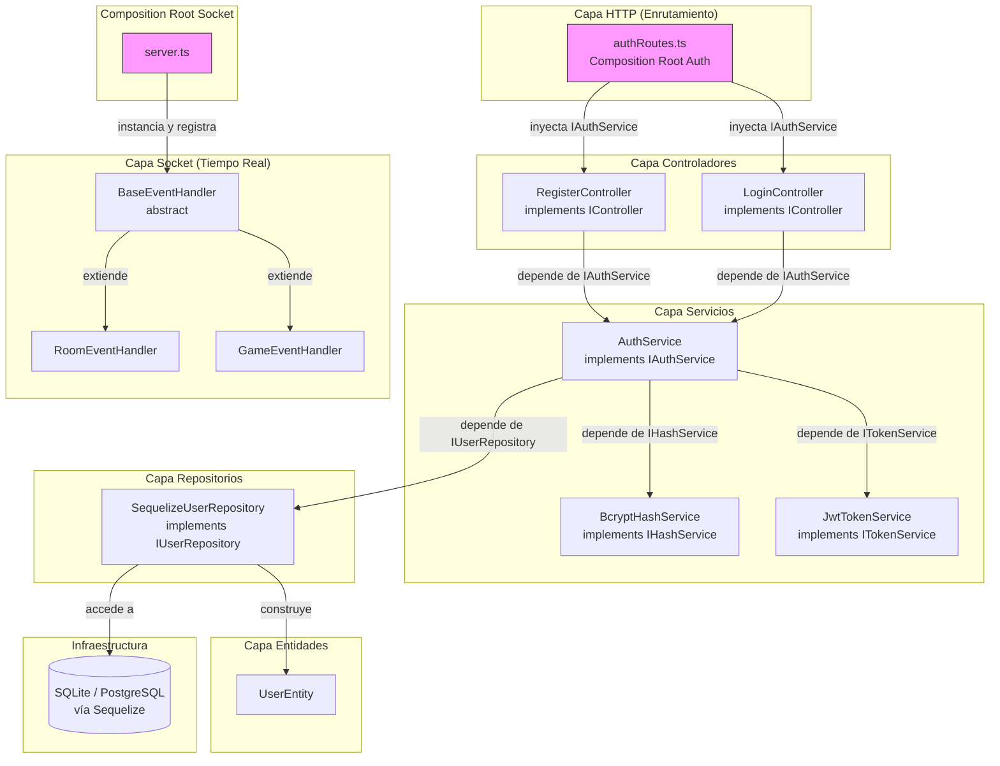
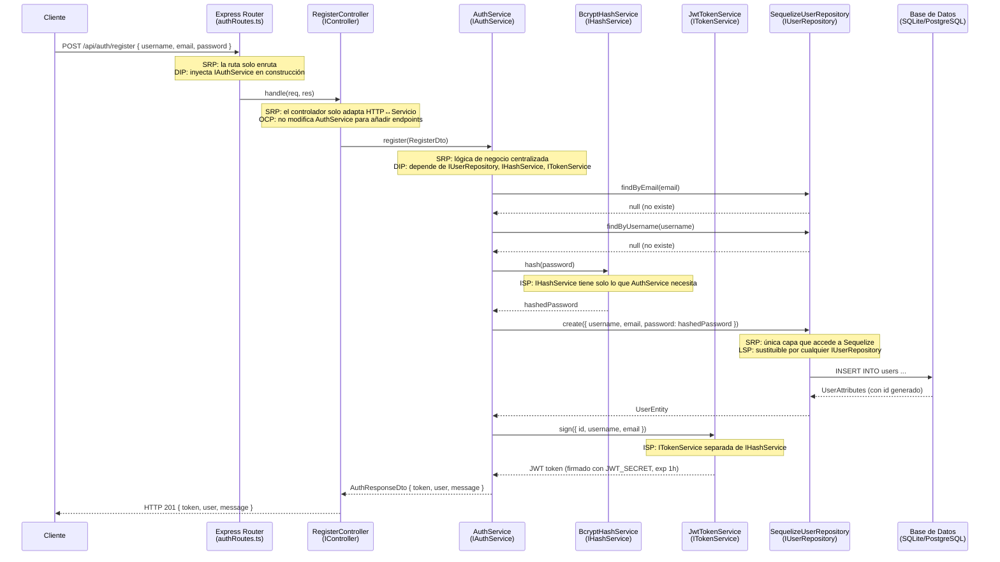

# Arquitectura del Backend — Elemental Battlecards

Este documento describe la arquitectura del backend refactorizado, aplicando los cinco principios SOLID y los cuatro pilares de la programación orientada a objetos. El backend gestiona dos módulos principales: autenticación (Auth) y partidas en tiempo real (Socket).

---

## Sección 1: Diagrama de Arquitectura en Capas

El backend se organiza en capas verticales donde las dependencias siempre apuntan hacia las abstracciones (interfaces), nunca hacia implementaciones concretas. Solo los Composition Roots (`authRoutes.ts` y `server.ts`) conocen las clases concretas.

**Flujo de dependencias**: `Entidades ← Repositorios ← Servicios ← Controladores ← Rutas (Composition Root)`.  
Las capas inferiores no conocen a las capas superiores. Cada capa se comunica con la capa inferior únicamente a través de una interfaz.

---

## Sección 2: Diagrama de Clases UML

El diagrama muestra las interfaces, las clases concretas que las implementan, la jerarquía de herencia de la capa Socket y las flechas de dependencia entre capas.

```mermaid
classDiagram
    class IUserRepository {
        <<interface>>
        +findByEmail(email: string) Promise~UserEntity|null~
        +findByUsername(username: string) Promise~UserEntity|null~
        +create(data: RegisterDto) Promise~UserEntity~
    }

    class IAuthService {
        <<interface>>
        +register(dto: RegisterDto) Promise~AuthResponseDto~
        +login(dto: LoginDto) Promise~AuthResponseDto~
    }

    class IHashService {
        <<interface>>
        +hash(plain: string) Promise~string~
        +compare(plain: string, hashed: string) Promise~boolean~
    }

    class ITokenService {
        <<interface>>
        +sign(payload: TokenPayload) string
        +verify(token: string) TokenPayload
    }

    class IController {
        <<interface>>
        +handle(req: Request, res: Response) Promise~void~
    }

    class UserEntity {
        -readonly _id: number
        -readonly _username: string
        -readonly _email: string
        -readonly _passwordHash: string
        +get id() number
        +get username() string
        +get email() string
        +get passwordHash() string
    }

    class SequelizeUserRepository {
        -readonly userModel: ModelDefined
        +findByEmail(email: string) Promise~UserEntity|null~
        +findByUsername(username: string) Promise~UserEntity|null~
        +create(data: RegisterDto) Promise~UserEntity~
    }

    class BcryptHashService {
        -readonly saltRounds: number
        +hash(plain: string) Promise~string~
        +compare(plain: string, hashed: string) Promise~boolean~
    }

    class JwtTokenService {
        -readonly secret: string
        -readonly expiresIn: string
        +sign(payload: TokenPayload) string
        +verify(token: string) TokenPayload
    }

    class AuthService {
        -readonly repository: IUserRepository
        -readonly hashService: IHashService
        -readonly tokenService: ITokenService
        +register(dto: RegisterDto) Promise~AuthResponseDto~
        +login(dto: LoginDto) Promise~AuthResponseDto~
    }

    class RegisterController {
        -readonly authService: IAuthService
        +handle(req: Request, res: Response) Promise~void~
    }

    class LoginController {
        -readonly authService: IAuthService
        +handle(req: Request, res: Response) Promise~void~
    }

    class BaseEventHandler {
        <<abstract>>
        #readonly io: Server
        #readonly rooms: RoomMap
        +registerEvents(socket: Socket)* void
        #emitToRoom(code, event, data) void
        #getRoomOrFail(code) Room|null
    }

    class RoomEventHandler {
        -generateCode() string
        +registerEvents(socket: Socket) void
    }

    class GameEventHandler {
        +registerEvents(socket: Socket) void
    }

    SequelizeUserRepository ..|> IUserRepository : implements
    BcryptHashService ..|> IHashService : implements
    JwtTokenService ..|> ITokenService : implements
    AuthService ..|> IAuthService : implements
    RegisterController ..|> IController : implements
    LoginController ..|> IController : implements
    RoomEventHandler --|> BaseEventHandler : extends
    GameEventHandler --|> BaseEventHandler : extends

    AuthService --> IUserRepository : depende de
    AuthService --> IHashService : depende de
    AuthService --> ITokenService : depende de
    RegisterController --> IAuthService : depende de
    LoginController --> IAuthService : depende de
    SequelizeUserRepository --> UserEntity : construye
```

**Puntos clave del diagrama**:

- Las clases concretas implementan interfaces (`..||>`), no heredan de otras clases concretas — se aplica el principio de **Inversión de Dependencias (DIP)**.
- `RoomEventHandler` y `GameEventHandler` extienden `BaseEventHandler` (`--|>`), aplicando **herencia** y el principio de **Sustitución de Liskov (LSP)**: cualquier `BaseEventHandler` puede ser reemplazado por cualquiera de sus subclases.
- `UserEntity` encapsula sus atributos con `private readonly`, aplicando **encapsulamiento**.

---

## Sección 3: Flujo de `POST /api/auth/register`

Esta sección describe el recorrido completo de una petición de registro desde el cliente hasta la base de datos, indicando la capa involucrada y el principio SOLID aplicado en cada paso.

### Diagrama de Secuencia

### Principio SOLID aplicado en cada capa

| Capa | Archivo | Principio SOLID | Justificación |
|------|---------|-----------------|---------------|
| Enrutamiento | `authRoutes.ts` | **DIP** — Inversión de Dependencias | Construye las instancias concretas pero las inyecta como abstracciones (`IAuthService`). Es el único lugar donde se conocen las clases concretas. |
| Controlador | `RegisterController.ts` | **SRP** — Responsabilidad Única | Solo adapta la petición HTTP al servicio. No contiene hashing, validación de negocio ni acceso a base de datos. |
| Controlador | `RegisterController.ts` | **OCP** — Abierto/Cerrado | Se puede añadir un nuevo endpoint sin modificar `AuthService`. |
| Servicio | `AuthService.ts` | **SRP** | Centraliza toda la lógica de negocio de autenticación en un único lugar. |
| Servicio | `AuthService.ts` | **DIP** | Depende de `IUserRepository`, `IHashService` e `ITokenService` — nunca de clases concretas como `SequelizeUserRepository` o `bcrypt`. |
| Hash Service | `BcryptHashService.ts` | **ISP** — Segregación de Interfaces | `IHashService` contiene solo `hash` y `compare`. No mezcla responsabilidades de tokenización. |
| Token Service | `JwtTokenService.ts` | **ISP** | `ITokenService` contiene solo `sign` y `verify`. Separada completamente de `IHashService`. |
| Repositorio | `SequelizeUserRepository.ts` | **SRP** | Única capa que importa y usa Sequelize. Encapsula todo el acceso a la base de datos. |
| Repositorio | `SequelizeUserRepository.ts` | **LSP** — Sustitución de Liskov | Cualquier otra implementación de `IUserRepository` (p.ej. para PostgreSQL, MongoDB o un mock de test) puede sustituir a `SequelizeUserRepository` sin afectar las capas superiores. |

### Descripción narrativa del flujo

1. **Cliente → Express Router** (`authRoutes.ts`): El cliente envía `POST /api/auth/register` con `{ username, email, password }`. El router, que actúa como *Composition Root*, ya tiene construido e inyectado el grafo de dependencias al arrancar el servidor.

2. **Express Router → RegisterController**: La ruta delega la petición a `registerCtrl.handle(req, res)`. El controlador no sabe si el servicio usa bcrypt, JWT ni Sequelize.

3. **RegisterController → AuthService**: El controlador extrae el cuerpo de la petición y llama a `authService.register(req.body)`. Toda la lógica de validación y orquestación vive aquí.

4. **AuthService → SequelizeUserRepository**: El servicio verifica primero que el email no esté en uso y luego que el username tampoco. Si alguno existe, lanza `AuthError` con HTTP 409.

5. **AuthService → BcryptHashService**: Si no hay duplicados, el servicio pide al hash service que encripte la contraseña en texto plano. El resultado es un hash bcrypt irreversible.

6. **AuthService → SequelizeUserRepository**: El servicio persiste el nuevo usuario con la contraseña ya hasheada. El repositorio devuelve un `UserEntity` con el `id` generado por la base de datos.

7. **AuthService → JwtTokenService**: Con los datos del usuario creado, el servicio firma un JWT que expira en 1 hora y contiene `{ id, username, email }`.

8. **AuthService → RegisterController → Cliente**: El servicio devuelve un `AuthResponseDto` con el token y los datos públicos del usuario. El controlador responde con **HTTP 201** y ese objeto JSON.
